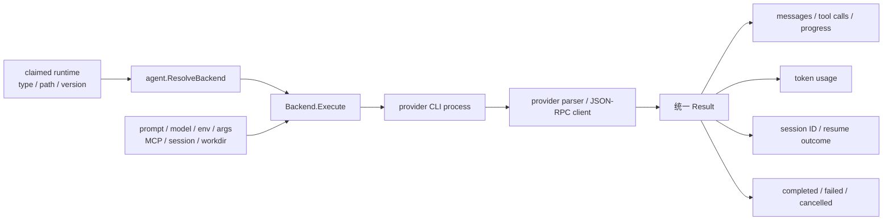

# 智能体适配器与 CLI

活跃贡献者：Bohan Jiang、Multica Eve、Jiayuan Zhang

`server/pkg/agent/` 把不同 AI 编程 CLI 的命令行、流式协议、session 和 usage 差异收敛到统一 `Backend`。守护进程只需要解析运行时的 protocol family，调用 `ResolveBackend`，再消费统一结果。

相关页面：[系统入口](index.md) · [守护进程与运行时](daemon-and-runtime.md) · [task 生命周期](agent-task-lifecycle.md)

## 数量口径：25 个协议家族，26 个内建身份

源码中有两个容易混淆的集合：

- [`server/pkg/agent/agent.go`](https://github.com/oldwinter/multica/blob/685cf788777e24724b0d82ffe88c56459341fb2a/server/pkg/agent/agent.go) 的 `SupportedTypes` 定义 **25 个 custom runtime protocol family**；
- [`server/pkg/agent/builtin_runtimes.go`](https://github.com/oldwinter/multica/blob/685cf788777e24724b0d82ffe88c56459341fb2a/server/pkg/agent/builtin_runtimes.go) 还定义独立的 `omp` 内建 runtime/provider identity，但 OMP 复用 `pi` 协议家族。

因此，"支持 26 个内建 AI 编程 CLI" 与 "支持 25 个协议家族" 都正确，但不能把两者写成同一份枚举。custom runtime profile 的 `protocol_family` 可选 25 项，不可填 `omp`；本机探测则可以同时注册 `pi` 和 `omp` 两个运行时。

## 支持集合

下表以 `SupportedTypes` 为准。命令名来自守护进程默认探测清单 [`scripts/agent-cli-command-names.txt`](https://github.com/oldwinter/multica/blob/685cf788777e24724b0d82ffe88c56459341fb2a/scripts/agent-cli-command-names.txt)；用户可通过 path 配置或 custom profile 指向其他可执行文件。

| # | protocol family | 默认命令 | 适配方式 |
| ---: | --- | --- | --- |
| 1 | `claude` | `claude` | Claude Code 专用流式 adapter |
| 2 | `codebuddy` | `codebuddy` | CodeBuddy 专用 adapter |
| 3 | `codex` | `codex` | Codex app-server/事件 adapter |
| 4 | `copilot` | `copilot` | GitHub Copilot CLI 事件 adapter |
| 5 | `opencode` | `opencode` | OpenCode 流式事件 adapter |
| 6 | `codearts` | `codearts` | CodeArts 专用 adapter |
| 7 | `deveco` | `deveco` | DevEco Code 专用 adapter |
| 8 | `openclaw` | `openclaw` | OpenClaw JSON 结果 adapter |
| 9 | `hermes` | `hermes` | ACP adapter，含 Hermes session/memory 处理 |
| 10 | `pi` | `pi` | Pi 流式 adapter；OMP 也复用此家族 |
| 11 | `cursor` | `cursor-agent` | Cursor headless 流式 adapter |
| 12 | `kimi` | `kimi` | ACP adapter |
| 13 | `reasonix` | `reasonix` | ACP adapter |
| 14 | `dsh` | `dsh` | DeepSeek Harness stdio adapter |
| 15 | `kiro` | `kiro-cli` | ACP adapter |
| 16 | `antigravity` | `agy` | Antigravity 专用 adapter |
| 17 | `qoder` | `qodercli` | ACP adapter |
| 18 | `qoderclicn` | `qoderclicn` | Qoder CN ACP adapter |
| 19 | `traecli` | `traecli` | ACP adapter |
| 20 | `grok` | `grok` | ACP adapter |
| 21 | `qwen` | `qwen` | `stream-json` adapter |
| 22 | `qwenpaw` | `qwenpaw` | ACP adapter |
| 23 | `mcode` | `mcode` | MiniMax Code ACP adapter |
| 24 | `dim` | `dim` | ACP adapter |
| 25 | `zeroclaw` | `zeroclaw` | ZeroClaw 专用 adapter |

额外的第 26 个内建身份是：

| runtime/provider identity | 命令 | protocol family |
| --- | --- | --- |
| `omp` | `omp` | `pi` |

`TestSupportedTypesLockstepWithNew` 防止 adapter 构造分支与 `SupportedTypes` 漂移，`TestSupportedTypesMatchesMigrationWhitelist` 防止 Go 白名单和数据库 migration CHECK 漂移。两项都在 [`server/pkg/agent/agent_supported_types_test.go`](https://github.com/oldwinter/multica/blob/685cf788777e24724b0d82ffe88c56459341fb2a/server/pkg/agent/agent_supported_types_test.go)。OMP 的独立探测语义由 [`server/internal/daemon/agents_probe_omp_test.go`](https://github.com/oldwinter/multica/blob/685cf788777e24724b0d82ffe88c56459341fb2a/server/internal/daemon/agents_probe_omp_test.go) 固定。

## 统一执行模型

守护进程不会在主循环里针对每个 provider 写条件分支。它构造统一执行选项，再交给 `ResolveBackend`。

统一层需要处理的契约包括：

- 启动命令、固定参数和用户参数；
- prompt 是走 stdin、argv、说明文件还是协议请求；
- model、thinking、speed 等 provider 选项；
- 流式文本、thinking、工具调用和错误事件；
- session 新建、恢复、拒绝恢复和退休；
- input/output/cache token usage；
- context cancellation 与子进程树回收；
- provider 已报告完成、但进程没有及时退出的情况。

adapter 返回统一结果后，守护进程负责 REST 回传和终态重试；adapter 不直接修改 `agent_task_queue`。这条边界让 provider 协议故障与服务端生命周期故障可以分别测试。

## 探测与运行时注册

守护进程启动时扫描默认命令名，执行轻量版本探测，并为每个可用工具构造运行时注册信息。内建探测主要位于 [`server/internal/daemon/agents_probe.go`](https://github.com/oldwinter/multica/blob/685cf788777e24724b0d82ffe88c56459341fb2a/server/internal/daemon/agents_probe.go)，运行时定义来自 [`server/pkg/agent/builtin_runtimes.go`](https://github.com/oldwinter/multica/blob/685cf788777e24724b0d82ffe88c56459341fb2a/server/pkg/agent/builtin_runtimes.go)。

探测有几条安全规则：

- 默认测试不能执行用户机器上真实安装的 agent CLI；
- 自定义 path 优先于 `PATH` 探测；
- 已生成的 hook wrapper 不能递归解析回自己；
- CLI 原地升级后，守护进程重新探测版本并注册，不需要重启；
- 某个 provider 暂时消失时，不能误删 custom profile runtime；
- `pi` 和 `omp` 即使共享协议，也要注册为两个 provider identity。

真实账号 smoke test 只在 `agentintegration` build tag 且显式设置 `MULTICA_RUN_REAL_AGENT_SMOKE=1` 时运行，防止普通测试消耗用户额度。

## custom runtime profile

custom profile 让工作区用公司包装器、固定启动参数或非标准安装路径执行现有协议。服务端保存的核心字段包括：

- `display_name`；
- `protocol_family`；
- `command_name` / command path；
- fixed args；
- visibility；
- enabled；
- 可选版本与能力信息。

守护进程同步 profile 后，把它转换为 launch spec。`protocol_family` 必须是 25 项 `SupportedTypes` 之一，因为它决定使用哪个 parser、session 和终态语义。自定义命令不等于新协议：如果包装器的输出不再符合所选 family，就必须增加新 adapter，而不是复用一个名称相近的 family。

custom profile 与内建运行时并存。运行时 ID 决定某次 claim 使用内建探测结果还是 custom launch spec，不能仅按 provider type 猜测。

## 参数、环境和 secret

执行参数按三层合并：

1. Multica 为协议正确性设置的固定参数；
2. 守护进程级环境变量默认参数；
3. 智能体 `custom_args`。

adapter 会过滤不能被覆盖的托管协议参数。例如 ACP server 子命令、stream 输出格式和工作目录参数必须由 Multica 控制，否则 parser 无法保证协议。支持 `*_ARGS` 的值使用 POSIX shellword 解析，不是按空格直接切分。

`custom_args` 会出现在子进程 argv，同机进程可能通过 `ps` 或 `/proc` 读取。secret 应放入 `custom_env` 或 MCP secret 字段，不要放入 args。守护进程日志遮蔽参数值并不能保护操作系统进程列表。

常见 daemon 级配置遵循以下命名：

| 用途 | 形式 | 示例 |
| --- | --- | --- |
| 可执行文件 | `MULTICA_<PROVIDER>_PATH` | `MULTICA_CODEX_PATH`、`MULTICA_CLAUDE_PATH`、`MULTICA_OMP_PATH` |
| model 覆盖 | `MULTICA_<PROVIDER>_MODEL` | `MULTICA_CODEX_MODEL`、`MULTICA_QWEN_MODEL` |
| 默认附加参数 | `MULTICA_<PROVIDER>_ARGS` | `MULTICA_CLAUDE_ARGS`、`MULTICA_CODEX_ARGS`、`MULTICA_QWEN_ARGS` |
| provider watchdog | 专用变量 | `MULTICA_OPENCODE_IDLE_WATCHDOG`、`MULTICA_CODEX_HANDSHAKE_TIMEOUT` |

并非每个 provider 都允许 model 或 args。QwenPaw 和 MCode 等工具自行管理部分选项；是否暴露配置由 adapter 能力决定，不应只按变量命名模式推断。

完整变量清单见 [`CLI_AND_DAEMON.md`](https://github.com/oldwinter/multica/blob/685cf788777e24724b0d82ffe88c56459341fb2a/CLI_AND_DAEMON.md)。

## 配置注入与 session

### prompt 与说明文件

不同 CLI 读取不同的仓库说明文件或协议字段。执行环境层按 runtime type 生成相应 sidecar，例如 provider-specific instructions、skill 目录和 `.multica` 资源信息；adapter 再选择 stdin、协议请求或受控参数传入主 prompt。

不能把所有 provider 当作 "命令 + prompt 参数"：

- Cursor 和 Pi 等路径会从 stdin 接收大 prompt，避免命令行长度与 argv 泄露；
- Qwen 使用受控 `stream-json` 输出；
- ACP 家族先 initialize，再 `session/new` 或 resume，最后 `session/prompt`；
- Codex 使用自己的 app-server 和 rollout/session 语义。

### MCP

ACP 家族从 canonical `{"mcpServers": {...}}` envelope 解析配置，并在新建或恢复 session 时通过 ACP 请求发送。远程 `http` / `sse` transport 还要受 runtime 宣告能力限制；stdio 不依赖远程 transport capability。

其他 provider 可能使用每次执行的 0600 临时配置文件。临时文件只包含当前任务需要的 MCP 配置，退出后清理，不改写用户家目录里的 CLI 配置。

### session

统一结果可以携带 session ID，但恢复能力由 provider 决定：

- 支持 resume/load 的 ACP adapter 使用对应协议方法；
- MCode 当前不声明 load session，后续 turn 会新建 session；
- Hermes transcript 与长期 memory 使用守护进程 profile 下按智能体和会话隔离的 store；
- Codex rollout/session store 与 task workdir 分离；
- 旧 session 被判断为 poison、context exhausted、auth resolution failure 或 rollout missing 时，恢复选择会排除它。

session ID 不应跨运行时盲目复用。服务端领取响应和本地准备层都检查 session 对当前 runtime/workdir 是否可达。

## 输出归一化

provider 对 "成功" 的表达不同：进程退出码、JSON terminal event、JSON-RPC response、流关闭和特定 stop reason 都可能参与判断。adapter 必须先把协议事件解释为统一状态，不能简单把 exit code 0 当作完成。

统一输出包含：

| 字段 | 来源示例 | 下游 |
| --- | --- | --- |
| 文本与 thinking | 流式 chunk / JSON event | task messages、浏览器 transcript |
| 工具调用 | tool start/update/result | 运行日志、进度 |
| session ID | session/new、resume、provider result | 后续 rerun/chat turn |
| usage | provider usage event 或终态统计 | task usage、聚合计量 |
| resume rejected | 协议错误或本地 session 缺失 | fresh-session 恢复 |
| status/error | terminal event、RPC result、watchdog | complete/fail 分类 |

adapter 解析器要容忍分片读取和尾部通知，但不能把截断流、空结果或未闭合工具调用误判为成功。provider 级测试大多使用临时 fake executable，验证真实 argv/stdin/stdout 契约而不调用已安装 CLI。

## 增加或修改 adapter

新增协议家族时按以下顺序修改，避免只让本地构建可用、数据库或 daemon 探测仍拒绝：

1. 在 `server/pkg/agent/` 实现 `Backend` 与 provider parser。
2. 把 family 加入 [`server/pkg/agent/agent.go`](https://github.com/oldwinter/multica/blob/685cf788777e24724b0d82ffe88c56459341fb2a/server/pkg/agent/agent.go) 的构造分支和 `SupportedTypes`。
3. 若是内建 CLI，在 [`server/pkg/agent/builtin_runtimes.go`](https://github.com/oldwinter/multica/blob/685cf788777e24724b0d82ffe88c56459341fb2a/server/pkg/agent/builtin_runtimes.go) 增加 identity 和能力。
4. 更新守护进程 probe、path/model/args 解析与版本刷新。
5. 更新数据库 protocol family CHECK migration。
6. 把默认命令加入 [`scripts/agent-cli-command-names.txt`](https://github.com/oldwinter/multica/blob/685cf788777e24724b0d82ffe88c56459341fb2a/scripts/agent-cli-command-names.txt)，防止默认测试意外执行环境中的真实 CLI。
7. 增加 fake executable 测试，覆盖启动参数、stdin、事件分片、usage、取消、session 和异常终态。
8. 更新 CLI/daemon 用户文档和安装说明。

如果只是增加一个复用现有协议的内建 provider identity，参考 OMP：增加内建探测和 provider identity，但不要把 identity 误加成第 26 个 protocol family。

## 测试入口

| 层 | 代表文件 | 覆盖内容 |
| --- | --- | --- |
| whitelist | [`server/pkg/agent/agent_supported_types_test.go`](https://github.com/oldwinter/multica/blob/685cf788777e24724b0d82ffe88c56459341fb2a/server/pkg/agent/agent_supported_types_test.go) | 构造分支、Go whitelist、migration whitelist 同步 |
| 公共契约 | [`server/pkg/agent/agent_test.go`](https://github.com/oldwinter/multica/blob/685cf788777e24724b0d82ffe88c56459341fb2a/server/pkg/agent/agent_test.go) | Backend 解析和公共行为 |
| provider | `server/pkg/agent/<provider>_test.go` | argv、协议事件、usage、session、取消 |
| daemon probe | `server/internal/daemon/agents_probe_*_test.go` | PATH、版本与 runtime identity |
| custom profile | `server/internal/daemon/runtime_profile_test.go` | profile → launch spec |
| 集成 smoke | [`server/pkg/agent/real_agent_smoke_integration_test.go`](https://github.com/oldwinter/multica/blob/685cf788777e24724b0d82ffe88c56459341fb2a/server/pkg/agent/real_agent_smoke_integration_test.go) | 显式授权后调用真实账号 |

普通测试不得查找或运行用户安装的 CLI。需要真实 smoke 时，按仓库测试规范显式设置 build tag 与 `MULTICA_RUN_REAL_AGENT_SMOKE=1`。

## 关键源码

| 文件 | 作用 |
| --- | --- |
| [`server/pkg/agent/agent.go`](https://github.com/oldwinter/multica/blob/685cf788777e24724b0d82ffe88c56459341fb2a/server/pkg/agent/agent.go) | `Backend`、`ResolveBackend` 与 25 个协议家族 |
| [`server/pkg/agent/builtin_runtimes.go`](https://github.com/oldwinter/multica/blob/685cf788777e24724b0d82ffe88c56459341fb2a/server/pkg/agent/builtin_runtimes.go) | 26 个内建 runtime/provider identity |
| [`server/pkg/agent/version.go`](https://github.com/oldwinter/multica/blob/685cf788777e24724b0d82ffe88c56459341fb2a/server/pkg/agent/version.go) | CLI 版本探测 |
| [`server/internal/daemon/agents_probe.go`](https://github.com/oldwinter/multica/blob/685cf788777e24724b0d82ffe88c56459341fb2a/server/internal/daemon/agents_probe.go) | 守护进程内建 CLI 探测与注册 |
| [`server/internal/daemon/agents_refresh.go`](https://github.com/oldwinter/multica/blob/685cf788777e24724b0d82ffe88c56459341fb2a/server/internal/daemon/agents_refresh.go) | CLI 版本变化后的运行时刷新 |
| `server/internal/daemon/execenv/` | provider sidecar、skill、MCP、session 和 workdir 准备 |
| [`scripts/agent-cli-command-names.txt`](https://github.com/oldwinter/multica/blob/685cf788777e24724b0d82ffe88c56459341fb2a/scripts/agent-cli-command-names.txt) | 默认 agent 命令安全清单 |
