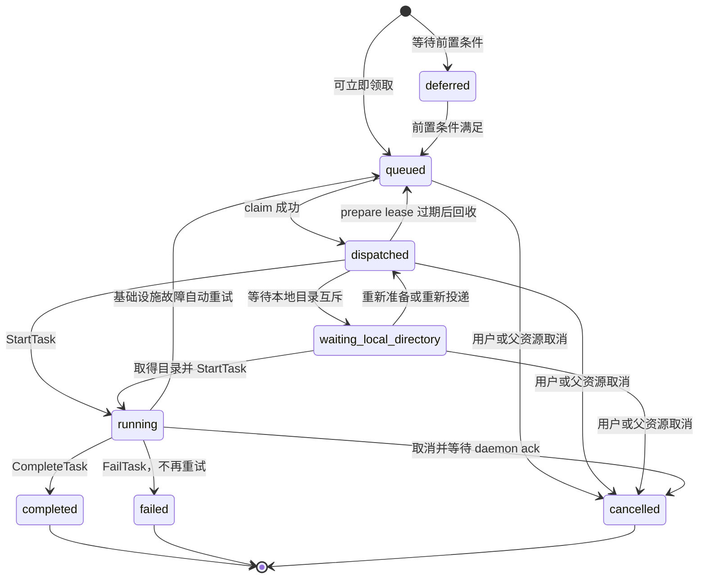
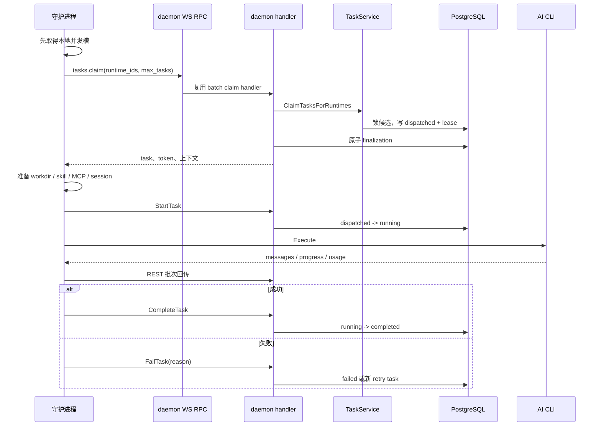

# task 生命周期

活跃贡献者：Bohan Jiang、Multica Eve、Jiayuan Zhang

`task` 是智能体的一次具体执行记录，不是用户创建的任务实体 `issue`。一个 `issue`、聊天会话或自动化运行可以先后产生多个 `task`；服务端通过 `agent_task_queue` 保存每次执行的排队、领取、运行和终态。

相关页面：[系统入口](index.md) · [守护进程与运行时](daemon-and-runtime.md) · [实时事件总线](realtime-event-bus.md)

## 状态模型

主状态机由 [`server/internal/service/task.go`](https://github.com/oldwinter/multica/blob/685cf788777e24724b0d82ffe88c56459341fb2a/server/internal/service/task.go) 的业务操作和 [`server/pkg/db/queries/agent.sql`](https://github.com/oldwinter/multica/blob/685cf788777e24724b0d82ffe88c56459341fb2a/server/pkg/db/queries/agent.sql) 的条件更新共同约束。

| 状态 | 含义 | 主要写入方 |
| --- | --- | --- |
| `deferred` | 记录已创建，但媒体、前序 turn 或其他前置条件尚未完成 | 触发 handler / `TaskService` |
| `queued` | 已具备领取条件 | `TaskService` |
| `dispatched` | 某个运行时已经领取，仍在准备本地环境 | claim 事务 |
| `waiting_local_directory` | 守护进程正在等同一本地目录的互斥条件 | 守护进程 REST 回报 |
| `running` | 环境准备完成，AI 编程 CLI 已进入执行阶段 | StartTask |
| `completed` | 正常完成，结果和最终元数据已经结算 | CompleteTask |
| `failed` | 最终失败，不会由当前失败处理继续重试 | FailTask |
| `cancelled` | 用户、父资源或系统取消了本次执行 | cancel 操作 |

不是每个 `task` 都会经过所有中间状态。无本地目录竞争的执行通常走 `queued → dispatched → running`；领取后发现任务已经取消时，可能不启动 CLI 就进入终态。

## 入队

### 触发来源

入队入口不只有 `issue` 分配。聊天消息、评论中的智能体提及、自动化、quick create、房间/小队协作和外部渠道都可以创建 `task`。这些入口最终复用 `TaskService`，因此状态、通知、重复任务检查和失败处理保持一致。

`TaskService` 在入队时固化执行所需的路由信息，例如工作区、智能体、运行时、触发来源、优先级和输入归属。运行时绑定是强约束：任务不会因为目标机器暂时离线就自动漂移到另一台机器。

### `deferred` 与 `queued`

`queued` 表示现在可以领取。`deferred` 用于必须先完成另一个原子步骤的场景，例如外部渠道媒体仍在绑定，或一次聊天 turn 需要等当前执行结算。前置步骤完成后再提升为 `queued`，避免守护进程看到不完整上下文。

队列创建成功后，`NotifyTaskAvailable` 先使 Redis 的空领取判断失效，再发送守护进程 wake。这个顺序防止刚入队的任务被旧的 "该运行时为空" 缓存遮住。实现见 [`server/internal/service/task.go`](https://github.com/oldwinter/multica/blob/685cf788777e24724b0d82ffe88c56459341fb2a/server/internal/service/task.go)，回归测试见 [`server/internal/service/task_notify_test.go`](https://github.com/oldwinter/multica/blob/685cf788777e24724b0d82ffe88c56459341fb2a/server/internal/service/task_notify_test.go)。

## 领取算法

守护进程把自己拥有的运行时 ID 集合作为一次 batch claim 提交。服务端不是简单取第一条 `queued` 记录，而是依次应用数据库和业务约束。

### 候选排序与并发

领取查询在 [`server/pkg/db/queries/agent.sql`](https://github.com/oldwinter/multica/blob/685cf788777e24724b0d82ffe88c56459341fb2a/server/pkg/db/queries/agent.sql) 中使用 `FOR UPDATE SKIP LOCKED`。并发 claim 不等待同一候选行：一个事务锁住后，其他事务继续看下一条。候选按以下键排序：

1. 优先级；
2. 创建时间；
3. `task` ID，作为稳定的最终排序键。

claim 同时检查：

- `task` 仍处于可领取状态；
- 绑定运行时在线，最近心跳在 150 秒 freshness 窗口内；
- 运行时归属和智能体对 private/public runtime 的访问仍有效；
- 智能体当前活跃执行数低于 `max_concurrent_tasks`；
- issue、聊天、房间和 quick-create 等需要串行的会话没有冲突任务；
- stale `dispatched` 记录已经越过 prepare lease 与响应恢复窗口。

单个候选失败不应破坏已经成功领取的其他运行时结果。批量领取对部分成功有专门测试：[`server/internal/service/task_batch_claim_partial_test.go`](https://github.com/oldwinter/multica/blob/685cf788777e24724b0d82ffe88c56459341fb2a/server/internal/service/task_batch_claim_partial_test.go)。

### prepare lease 与不确定响应

claim 把状态写为 `dispatched`，同时建立默认 45 秒的 prepare lease。守护进程准备耗时环境时可以续租；环境准备完成后调用 StartTask，进入 `running`。

有两个时间窗口不能混为一谈：

- **prepare lease**：证明领取者仍在准备任务，默认 45 秒；
- **claim response recovery window**：处理服务端已提交 claim、但响应在网络中丢失的情况，为 90 秒。

如果守护进程在 WS RPC 发出前就确认请求未发送，可以安全改走 HTTP。如果请求已经发出但结果不确定，立即再 claim 可能把同一任务领两次，因此客户端先等待恢复窗口，再允许重新领取。对应行为由 [`server/internal/daemon/daemon_legacy_fallback_test.go`](https://github.com/oldwinter/multica/blob/685cf788777e24724b0d82ffe88c56459341fb2a/server/internal/daemon/daemon_legacy_fallback_test.go) 的 `TestClaimTasksWSFirst_NoDoubleClaimOnDetach` 固定。

### Redis 只减少空查询

`EmptyClaimCache` 记录某个运行时最近一次没有候选，版本号在新任务入队时递增。`ReclaimCheckCache` 提示哪些运行时可能到了 stale reclaim 检查时间。两者都 fail-open：

- 没有 Redis 时检查全部运行时；
- Redis 读写错误时检查数据库；
- 缓存不能改变 PostgreSQL 状态；
- 90 秒不确定响应恢复仍由数据库时间与 CAS 条件保护。

相关测试位于 [`server/internal/service/empty_claim_cache_test.go`](https://github.com/oldwinter/multica/blob/685cf788777e24724b0d82ffe88c56459341fb2a/server/internal/service/empty_claim_cache_test.go) 和 [`server/internal/service/reclaim_check_cache_test.go`](https://github.com/oldwinter/multica/blob/685cf788777e24724b0d82ffe88c56459341fb2a/server/internal/service/reclaim_check_cache_test.go)。

## 领取结果的原子结算

SQL claim 只是第一步。handler 还要装载 prompt、skill、MCP、项目资源、session 和调用者信息。最终返回给守护进程前，服务端在同一事务中完成：

- 创建 task-scoped `mat_` token；
- 必要时创建 Remote MCP 使用的守护进程 token；
- 占用评论/消息 delivery receipt；
- 写入 Twin attribution；
- 固化与本次执行绑定的上下文。

只要其中一步失败，claim finalization 就回滚。服务端以原来的 `dispatched_at` 做 CAS，把准确的那次领取重新放回队列，避免把另一次新领取误回滚。实现入口在 [`server/internal/handler/daemon.go`](https://github.com/oldwinter/multica/blob/685cf788777e24724b0d82ffe88c56459341fb2a/server/internal/handler/daemon.go)，事务回归测试见 [`server/internal/service/task_finalize_failure_test.go`](https://github.com/oldwinter/multica/blob/685cf788777e24724b0d82ffe88c56459341fb2a/server/internal/service/task_finalize_failure_test.go) 和 [`server/internal/handler/daemon_batch_claim_finalize_test.go`](https://github.com/oldwinter/multica/blob/685cf788777e24724b0d82ffe88c56459341fb2a/server/internal/handler/daemon_batch_claim_finalize_test.go)。

## 从领取到运行

守护进程先取得本地并发槽，再 claim。这样数据库不会产生一批已经 `dispatched`、却在本机等待容量的任务。全局本地并发上限和服务端智能体并发上限是两个独立门槛，实际吞吐取较小者。

环境准备完成后才调用 StartTask。准备失败仍走统一 fail 路径，但不能把 CLI 尚未启动的任务误标为长期 `running`。本地执行细节见[守护进程与运行时](daemon-and-runtime.md#本地执行流水线)。

## 过程数据与终态

运行期间，守护进程通过 REST 回传：

- progress；
- 单条或批量 messages，包括文本、thinking 和工具调用；
- token usage；
- session ID 与可恢复工作目录；
- complete 或 fail；
- 取消后的 cancel-ack。

服务端终态接口是幂等的。网络超时后重发相同 complete/fail，不会再次结算同一任务。终态提交前，守护进程尽量先送达累计用量；服务端写入终态后尽早撤销 `mat_` token。

终态回调遇到瞬时错误时按 4、8、16、32、64 秒退避重试。永久 complete 错误可以转入 fail 上报；已经发出但结果不确定的瞬时 complete 不能贸然降级为 fail，否则服务端可能已经成功完成任务。测试见 [`server/internal/daemon/daemon_test.go`](https://github.com/oldwinter/multica/blob/685cf788777e24724b0d82ffe88c56459341fb2a/server/internal/daemon/daemon_test.go) 中 `TestReportTaskResult_*` 系列。

## 失败与自动重试

FailTask 先分类失败原因，再决定当前任务进入最终 `failed`，还是创建/恢复一条可领取的重试。自动重试面向基础设施故障，不用于掩盖智能体明确返回的业务失败。

| 失败类 | 默认处理 | 说明 |
| --- | --- | --- |
| `runtime_offline` / `runtime_recovery` | 可自动重试 | 守护进程离线或启动时接管旧进程遗留任务 |
| 超时、Codex 语义无活动 | 可自动重试 | 受 watchdog 与专用超时配置约束 |
| provider network | 最多 3 次尝试 | 最后一次重试约延迟 5 秒 |
| skill bundle unavailable | 可自动重试 | 等 bundle 可读取后再执行 |
| 上下文耗尽、session poison | 放弃旧 session 后走恢复策略 | 防止继续选择已知不可用 session |
| 普通 agent error | 最终失败 | 保留诊断，不无限重跑 |

自动重试前会检查是否已经有手工 rerun 排队；若有，就不再额外创建自动重试，避免同一输入重复执行。相关回归见 [`server/internal/handler/fail_task_successor_test.go`](https://github.com/oldwinter/multica/blob/685cf788777e24724b0d82ffe88c56459341fb2a/server/internal/handler/fail_task_successor_test.go)。

### 手工 rerun

手工 rerun 创建新的执行记录，而不是把旧终态行改回 `queued`。新记录可以继承适用的工作目录和健康 session，同时保留旧记录作为审计历史。若旧 session 已标记为 retired、poisoned、认证解析失败或 rollout 缺失，选择逻辑会排除它并从新 session 开始。

session 选择与恢复测试集中在：

- [`server/cmd/server/rerun_session_test.go`](https://github.com/oldwinter/multica/blob/685cf788777e24724b0d82ffe88c56459341fb2a/server/cmd/server/rerun_session_test.go)；
- [`server/cmd/server/retired_session_test.go`](https://github.com/oldwinter/multica/blob/685cf788777e24724b0d82ffe88c56459341fb2a/server/cmd/server/retired_session_test.go)；
- [`server/internal/handler/daemon_claim_cancelled_session_test.go`](https://github.com/oldwinter/multica/blob/685cf788777e24724b0d82ffe88c56459341fb2a/server/internal/handler/daemon_claim_cancelled_session_test.go)。

## 取消

取消可以发生在 `queued`、`dispatched`、`waiting_local_directory` 或 `running`。数据库先把任务推进到 `cancelled`，守护进程约每 5 秒查询当前状态；收到终态、`cancelled` 或 404 后中断 CLI 进程树。WebSocket reconcile 信号可以让该检查提前发生，但轮询仍是兜底。

CLI 停止后，守护进程发送 cancel-ack。这个 ack 不只是确认进程退出，还让服务端结算：

- 已经产生的 transcript；
- session ID；
- durable workdir；
- worktree 分支和最后可保留的本地改动；
- 取消前累计的 usage。

因此，"数据库已取消" 与 "本地执行已经停止且工件已结算" 是两个时间点。取消观察和 ack 测试见 [`server/internal/daemon/daemon_test.go`](https://github.com/oldwinter/multica/blob/685cf788777e24724b0d82ffe88c56459341fb2a/server/internal/daemon/daemon_test.go) 中 `TestWatchTaskCancellation_*` 与 `TestHandleTask_AcksCancel*`。

## 崩溃与陈旧任务恢复

### 守护进程重启

守护进程启动时调用 recover-orphans，识别前一个本地进程留下的任务，并以 `runtime_recovery` 失败原因送入同一套服务端重试分类。恢复不直接修改数据库为成功，也不静默继续一个无法证明仍存活的子进程。

### stale `dispatched`

如果领取响应丢失或守护进程在准备阶段崩溃，记录会停在 `dispatched`。只有 prepare lease 过期，并且越过 claim response recovery window 后，其他 claim 才能用条件更新重新投递。新的领取会刷新 lease；旧客户端晚到的更新因状态或时间戳不匹配而失败。

### `running` orphan

运行时离线检测和恢复后台任务处理长期失去执行者的 `running` 记录。它们先被归类为基础设施故障，再按统一自动重试规则处理。运行时重连宽限与 freshness 不是同一个值：150 秒 freshness 控制新 claim，较长的重连宽限控制何时认定已有任务失败。

### session 与工作目录

session 和工作目录都必须按运行时可达性检查。session ID 只对能访问其本地存储的运行时有意义；本地目录和 worktree 也不能无条件跨机器恢复。恢复代码会拒绝已退休或已毒化 session，并在无法安全复用时创建新环境，而不是假装延续上下文。

## 事件与投影

状态转换会发布 `task:queued`、`task:dispatch`、`task:running`、`task:waiting_local_directory`、`task:progress`、`task:message`、`task:completed`、`task:failed` 和 `task:cancelled` 等事件。通知、活动、聊天、外部渠道和浏览器实时更新由监听器投影，不应反向成为任务状态的权威来源。

事件细节和多节点语义见[实时事件总线](realtime-event-bus.md)。

## 修改与测试

| 修改类型 | 主要文件 | 至少检查 |
| --- | --- | --- |
| 新增状态或改变状态转换 | [`server/internal/service/task.go`](https://github.com/oldwinter/multica/blob/685cf788777e24724b0d82ffe88c56459341fb2a/server/internal/service/task.go)、[`server/pkg/db/queries/agent.sql`](https://github.com/oldwinter/multica/blob/685cf788777e24724b0d82ffe88c56459341fb2a/server/pkg/db/queries/agent.sql) | SQL CAS、终态幂等、事件投影、取消观察 |
| 改 claim 候选或容量 | [`server/pkg/db/queries/agent.sql`](https://github.com/oldwinter/multica/blob/685cf788777e24724b0d82ffe88c56459341fb2a/server/pkg/db/queries/agent.sql) | [`server/internal/service/task_claim_race_test.go`](https://github.com/oldwinter/multica/blob/685cf788777e24724b0d82ffe88c56459341fb2a/server/internal/service/task_claim_race_test.go)、batch claim 测试 |
| 改 claim 响应内容 | [`server/internal/handler/daemon.go`](https://github.com/oldwinter/multica/blob/685cf788777e24724b0d82ffe88c56459341fb2a/server/internal/handler/daemon.go) | finalization 原子性、workspace/runtime access |
| 改失败分类或重试 | [`server/internal/service/task.go`](https://github.com/oldwinter/multica/blob/685cf788777e24724b0d82ffe88c56459341fb2a/server/internal/service/task.go) | [`server/internal/service/task_complete_race_test.go`](https://github.com/oldwinter/multica/blob/685cf788777e24724b0d82ffe88c56459341fb2a/server/internal/service/task_complete_race_test.go)、rerun/session 测试 |
| 改取消行为 | [`server/internal/daemon/daemon.go`](https://github.com/oldwinter/multica/blob/685cf788777e24724b0d82ffe88c56459341fb2a/server/internal/daemon/daemon.go) | cancel-ack、usage、transcript、worktree settle |

数据库测试需要可用 PostgreSQL；纯分类、缓存和守护进程协议测试可单独运行。测试命令和 fixture 规范见[测试指南](../how-to-contribute/testing.md)。

## 关键源码

| 文件 | 作用 |
| --- | --- |
| [`server/internal/service/task.go`](https://github.com/oldwinter/multica/blob/685cf788777e24724b0d82ffe88c56459341fb2a/server/internal/service/task.go) | 入队、领取、完成、失败、重试和通知 |
| [`server/pkg/db/queries/agent.sql`](https://github.com/oldwinter/multica/blob/685cf788777e24724b0d82ffe88c56459341fb2a/server/pkg/db/queries/agent.sql) | 队列锁、状态 CAS、lease、session 与容量 SQL |
| [`server/internal/handler/task_lifecycle.go`](https://github.com/oldwinter/multica/blob/685cf788777e24724b0d82ffe88c56459341fb2a/server/internal/handler/task_lifecycle.go) | task 生命周期 HTTP 边界 |
| [`server/internal/handler/daemon.go`](https://github.com/oldwinter/multica/blob/685cf788777e24724b0d82ffe88c56459341fb2a/server/internal/handler/daemon.go) | 守护进程 claim、start 和终态 handler |
| [`server/internal/daemon/daemon.go`](https://github.com/oldwinter/multica/blob/685cf788777e24724b0d82ffe88c56459341fb2a/server/internal/daemon/daemon.go) | 本地领取、执行、取消观察和终态重试 |
| [`server/internal/service/task_batch_claim_test.go`](https://github.com/oldwinter/multica/blob/685cf788777e24724b0d82ffe88c56459341fb2a/server/internal/service/task_batch_claim_test.go) | 多运行时批量领取与 reclaim 提示 |
| [`server/internal/service/task_cancel_finalize_test.go`](https://github.com/oldwinter/multica/blob/685cf788777e24724b0d82ffe88c56459341fb2a/server/internal/service/task_cancel_finalize_test.go) | 取消结算行为 |
