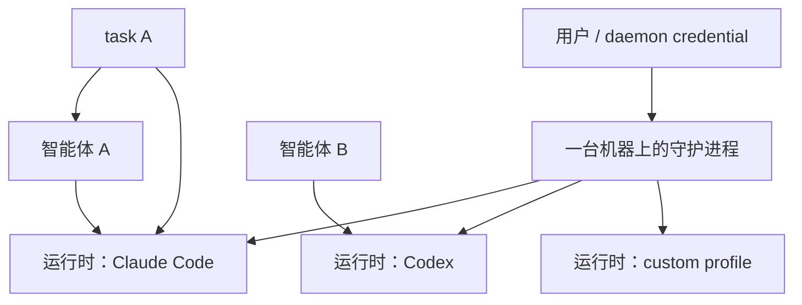
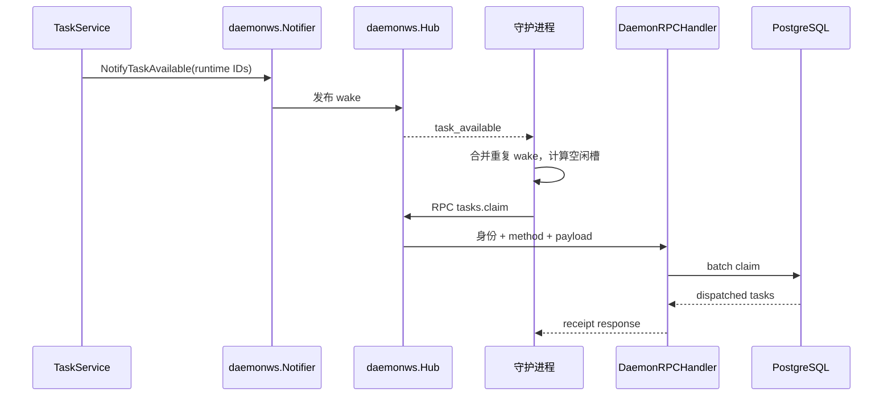
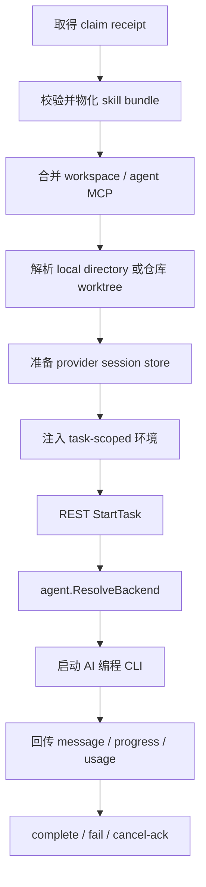

# 守护进程与运行时

活跃贡献者：Bohan Jiang、Multica Eve、Jiayuan Zhang

守护进程把一台用户控制的机器接入 Multica。它探测本机 AI 编程 CLI，为每个工具注册运行时，通过 WebSocket 接收唤醒和领取任务，并在本机准备目录、启动进程、收集输出，再通过 REST 回传服务端。

相关页面：[系统入口](index.md) · [task 生命周期](agent-task-lifecycle.md) · [智能体适配器与 CLI](agent-adapters-and-cli.md) · [实时事件总线](realtime-event-bus.md)

## 身份关系

守护进程、运行时和智能体不是同一个对象：

- **守护进程**：一台机器上的常驻本地进程，有稳定 daemon ID、用户身份和工作区 watch list。
- **运行时**：该守护进程探测或配置出的一个可执行工具，例如同一台机器上的 Claude Code 和 Codex 是两个运行时。
- **智能体**：工作区中的长期配置，保存指令、模型、skill、Access 和绑定的 runtime ID。
- **`task`**：智能体的一次执行，领取后固定到某个运行时。



运行时绑定决定任务在哪台机器、用哪个协议执行。服务端不会因为另一个运行时空闲就迁移任务；session、目录和主机凭据通常也不具备跨机器可移植性。

## 启动、注册与心跳

守护进程入口位于 [`server/internal/daemon/daemon.go`](https://github.com/oldwinter/multica/blob/685cf788777e24724b0d82ffe88c56459341fb2a/server/internal/daemon/daemon.go)，HTTP 客户端位于 [`server/internal/daemon/client.go`](https://github.com/oldwinter/multica/blob/685cf788777e24724b0d82ffe88c56459341fb2a/server/internal/daemon/client.go)。

启动阶段按以下顺序建立执行能力：

1. 读取 profile、服务端 URL、认证信息和 watch list。
2. 生成或加载稳定 daemon ID。
3. 探测内建 CLI，并加载服务器下发的 custom runtime profile。
4. 向每个工作区注册运行时及其 CLI 版本、provider identity 和能力。
5. 启动心跳、WebSocket 控制连接、周期 claim poll、运行时版本刷新和本地 GC。
6. 执行 orphan recovery，结算前一个守护进程留下的任务。

默认每 15 秒发送一次心跳。服务端把最近心跳写入运行时记录；新 claim 要求运行时在 150 秒 freshness 窗口内。更长的 runtime reconnect grace 用于判断已经在途的任务何时失败，不能拿 freshness 代替。

守护进程停止时会注销运行时。异常退出无法走注销，因此服务端仍以 `last_seen_at` 和恢复扫描识别离线。

## WebSocket 控制面

### 连接与协商

守护进程连接：

```text
ws(s)://<server>/api/daemon/ws?runtime_ids=<sorted,comma-separated-runtime-ids>
```

URL 转换和 query 构造见 [`server/internal/daemon/wakeup.go`](https://github.com/oldwinter/multica/blob/685cf788777e24724b0d82ffe88c56459341fb2a/server/internal/daemon/wakeup.go)，对应断言在 [`server/internal/daemon/wakeup_test.go`](https://github.com/oldwinter/multica/blob/685cf788777e24724b0d82ffe88c56459341fb2a/server/internal/daemon/wakeup_test.go)。服务端 upgrade、身份绑定和连接登记在 [`server/internal/handler/daemon_ws.go`](https://github.com/oldwinter/multica/blob/685cf788777e24724b0d82ffe88c56459341fb2a/server/internal/handler/daemon_ws.go) 与 [`server/internal/daemonws/hub.go`](https://github.com/oldwinter/multica/blob/685cf788777e24724b0d82ffe88c56459341fb2a/server/internal/daemonws/hub.go)。

连接建立后双方协商 capability。只有服务端与客户端都支持 `rpc-v1` 时，守护进程才把 claim 当作 WebSocket RPC 发送；否则 WebSocket 只传 wake/heartbeat，领取继续走 HTTP。

### wake 与 `tasks.claim`



`tasks.claim` 的 handler 不实现第二套领取逻辑。[`server/internal/handler/daemon_rpc.go`](https://github.com/oldwinter/multica/blob/685cf788777e24724b0d82ffe88c56459341fb2a/server/internal/handler/daemon_rpc.go) 使用 WebSocket 连接上已经认证的 `ClientIdentity`，复用 HTTP batch claim handler。测试 [`server/internal/handler/daemon_rpc_test.go`](https://github.com/oldwinter/multica/blob/685cf788777e24724b0d82ffe88c56459341fb2a/server/internal/handler/daemon_rpc_test.go) 验证 RPC 领取后数据库状态为 `dispatched`。

wake 是边沿提示，不是队列消息：

- 多个 wake 可以合并；
- 连接断开时 wake 可以丢失；
- 服务端发送成功不代表 claim 成功；
- 守护进程默认 30 秒的周期 poll 会补抓遗漏任务。

### HTTP 降级与防止双领

正常优先级是：

1. `rpc-v1` WebSocket batch claim；
2. HTTP batch claim，单次调用预算 5 秒；
3. 老服务端没有 batch route 时，逐 runtime legacy HTTP claim。

降级前必须区分请求是否已经发送。尚未发送的 WS 请求可以立即改走 HTTP；已经写入连接、但响应不确定的请求可能已在服务端提交。后者先等待 90 秒 claim response recovery window，避免立即发第二个 claim。数据库 prepare lease 和 `dispatched_at` CAS 提供最终保护。

这条规则集中在 [`server/internal/daemon/wsrpc.go`](https://github.com/oldwinter/multica/blob/685cf788777e24724b0d82ffe88c56459341fb2a/server/internal/daemon/wsrpc.go) 与 [`server/internal/daemon/daemon_legacy_fallback_test.go`](https://github.com/oldwinter/multica/blob/685cf788777e24724b0d82ffe88c56459341fb2a/server/internal/daemon/daemon_legacy_fallback_test.go)。

## 领取前的本地容量

守护进程维护全局 task slot semaphore，默认最多 20 个并发任务。poller 先取得槽，再按可用槽数设置 `max_tasks` 发起 claim。这样领取量不会超过本机立即能够处理的数量。

服务端还有每个智能体的 `max_concurrent_tasks`，默认通常是 6。两个限制作用于不同范围：

- 守护进程上限保护整台机器；
- 智能体上限控制某个身份的并发；
- 同一本地 direct directory 可能还有独立互斥；
- issue/chat/room 的会话顺序仍由服务端 claim SQL 约束。

取得槽后如果没有领到任务，槽立即释放。任务完成、失败或取消结算后也释放槽并触发下一轮 poll。

## 本地执行流水线

claim receipt 携带运行所需的智能体、输入、资源与临时凭据。守护进程的 `handleTask` / `runTask` 负责把它转换为可执行环境。



### 工作目录

常见环境包括守护进程管理的仓库 worktree、持久 issue 目录和用户选择的 local directory。目录准备必须防止同一物理目录被不安全地并发使用。worktree 模式可以并行，direct 模式需要本地互斥；等待时任务可以报告 `waiting_local_directory`。

本地环境的创建与锁定主要在 `server/internal/daemon/execenv/`。任务目录里可能写入 provider 所需的说明文件、skill、MCP 临时配置和 `.multica` 元数据。带 secret 的临时文件使用受限权限，并在运行后清理。

### skill 与 MCP

守护进程先验证 claim 中的 bundle identity，再下载或复用缓存。缓存内容不可用时以 `skill_bundle_unavailable` 失败，让服务端按基础设施故障重试。

MCP 注入取决于 adapter：

- ACP 家族通过 `session/new` 或 resume 请求发送 `McpServer`；
- 某些 CLI 使用每次执行的临时配置文件；
- Remote MCP 可以使用专门的 task/daemon credential；
- 不修改或合并用户自己的 CLI 全局配置，除非该 adapter 的明确契约要求。

细节见[智能体适配器与 CLI](agent-adapters-and-cli.md#配置注入与-session)。

### 进程与流式回传

[`server/pkg/agent/agent.go`](https://github.com/oldwinter/multica/blob/685cf788777e24724b0d82ffe88c56459341fb2a/server/pkg/agent/agent.go) 的 `ResolveBackend` 根据运行时 protocol family 选择 adapter。adapter 把 provider 的 stdout、stderr 或 JSON-RPC 通知归一为消息、工具调用、进度、usage、session ID 和结果。

守护进程在执行期间：

- 批量写入 task messages；
- 更新 progress；
- 累积并上报 usage；
- 约每 5 秒检查服务端取消状态；
- 维护 idle、tool 和 provider-specific watchdog；
- 在退出时 drain 已缓冲 transcript，再报告终态。

终态上报的网络重试与取消结算见 [task 生命周期](agent-task-lifecycle.md#过程数据与终态)。

## 认证与权限边界

### 守护进程凭据

daemon API 支持专用 `mdt_` daemon token，也兼容 PAT、JWT 和 cloud PAT。`mdt_` token 绑定 workspace 与 daemon ID；中间件先认证，具体 runtime/task handler 再校验请求资源属于该 daemon 可访问的工作区和运行时。

守护进程认证实现与测试位于：

- [`server/internal/middleware/daemon_auth.go`](https://github.com/oldwinter/multica/blob/685cf788777e24724b0d82ffe88c56459341fb2a/server/internal/middleware/daemon_auth.go)；
- [`server/internal/middleware/daemon_auth_test.go`](https://github.com/oldwinter/multica/blob/685cf788777e24724b0d82ffe88c56459341fb2a/server/internal/middleware/daemon_auth_test.go)。

### runtime visibility

运行时的 visibility 决定哪些智能体可以绑定和领取：

- **private runtime**：只有运行时 owner 拥有的智能体可用；
- **public/workspace runtime**：工作区中满足调用权限的智能体可用。

访问检查既发生在配置/查询边界，也在 claim 时重新执行，防止智能体 owner 或 runtime 绑定在入队后发生变化。claim 权限回归测试见 [`server/internal/service/runtime_claim_access_test.go`](https://github.com/oldwinter/multica/blob/685cf788777e24724b0d82ffe88c56459341fb2a/server/internal/service/runtime_claim_access_test.go) 与 [`server/internal/handler/daemon_runtime_access_test.go`](https://github.com/oldwinter/multica/blob/685cf788777e24724b0d82ffe88c56459341fb2a/server/internal/handler/daemon_runtime_access_test.go)。

### 智能体可见与可调用

能看到一个智能体不等于能启动它。Agent Access 分离 visibility 与 invocation permission；private agent 不因调用者是 admin 就获得隐式绕过。入队入口和提及预览都要使用同一权限语义，claim 时还会重新验证运行时访问。

### task token

claim finalization 为子进程签发 `mat_` token，绑定：

- user；
- workspace；
- agent；
- `task`。

守护进程把 task token 和 task identity 注入执行环境，但不把自己的 PAT、JWT 或 `mdt_` token 传给 AI CLI。CLI 命令检测到 task 环境却缺少 `mat_` token 时 fail closed，避免退回使用宿主 owner 凭据。complete、fail 或 cancel 后，服务端尽早撤销该 token；最长有效期也受服务端限制。

### 主机权限

AI CLI 以运行守护进程的操作系统用户权限执行。task token 限制 Multica API 权限，但不能限制进程读取该 Unix 用户可读的文件、SSH agent、Git credential helper 或网络。生产执行机应使用专用用户、容器或虚拟机，并把可访问目录与凭据控制在任务所需范围。

## 配置

常用配置同时支持 CLI flag、环境变量和 profile；具体优先级由 CLI resolver 处理。

| 设置 | 环境变量 | 默认值 | 作用 |
| --- | --- | --- | --- |
| claim catch-up poll | `MULTICA_DAEMON_POLL_INTERVAL` | `30s` | wake 丢失或 WS 断线时的兜底 |
| 心跳 | `MULTICA_DAEMON_HEARTBEAT_INTERVAL` | `15s` | 更新运行时在线状态 |
| 本机并发 | `MULTICA_DAEMON_MAX_CONCURRENT_TASKS` | `20` | task slot 数量 |
| 总执行超时 | `MULTICA_AGENT_TIMEOUT` | `0` | `0` 表示不设总上限 |
| idle watchdog | `MULTICA_AGENT_IDLE_WATCHDOG` | `2h` | 无有效活动时停止 |
| tool watchdog | `MULTICA_AGENT_TOOL_WATCHDOG` | 同 idle | 工具调用期间的独立预算 |
| Codex 语义无活动 | `MULTICA_CODEX_SEMANTIC_INACTIVITY_TIMEOUT` | 同 idle | Codex 专用恢复判断 |
| 工作区根目录 | `MULTICA_WORKSPACES_ROOT` | `~/multica_workspaces` | managed checkout 与 task 环境 |
| daemon ID | `MULTICA_DAEMON_ID` | hostname/持久身份 | 服务端机器身份 |
| device name | `MULTICA_DAEMON_DEVICE_NAME` | hostname | 用户可识别设备名 |

provider path/model/args 配置见[智能体适配器与 CLI](agent-adapters-and-cli.md#配置入口)。完整运维配置见仓库根目录 [`CLI_AND_DAEMON.md`](https://github.com/oldwinter/multica/blob/685cf788777e24724b0d82ffe88c56459341fb2a/CLI_AND_DAEMON.md)。

## 故障与恢复

| 现象 | 先检查 | 正确性兜底 |
| --- | --- | --- |
| 新任务没有立即领取 | `/api/daemon/ws` 是否连接、是否协商 `rpc-v1` | 30 秒周期 poll 与 HTTP claim |
| WS claim 后断线 | 日志是否显示结果不确定 | 等 90 秒恢复窗口，不立即双领 |
| 长时间停在 `dispatched` | prepare lease 是否续租、守护进程是否崩溃 | lease 过期后 stale reclaim |
| 运行时在线但不执行 | 本机 task slot、智能体并发、目录互斥 | 容量释放后 wake/poll 重试 |
| CLI 升级后版本不对 | 运行时版本 refresh 日志 | 不重启 daemon，重新探测并注册 |
| daemon 重启后旧任务仍 running | recover-orphans 与服务端恢复日志 | `runtime_recovery` 进入统一重试 |
| 取消后 CLI 仍短暂运行 | 取消轮询、reconcile 信号、进程树终止 | 约 5 秒轮询并发送 cancel-ack |

守护进程日志按 profile 存放。使用 `multica daemon logs --profile <name>` 让 CLI 打印实际解析到的日志路径，不要根据 `~/.multica/daemon.log` 猜测当前进程。

## 修改与测试

| 目标 | 修改入口 | 代表性测试 |
| --- | --- | --- |
| 改 WS 连接、心跳或 wake | [`server/internal/daemon/wakeup.go`](https://github.com/oldwinter/multica/blob/685cf788777e24724b0d82ffe88c56459341fb2a/server/internal/daemon/wakeup.go)、[`server/internal/daemonws/hub.go`](https://github.com/oldwinter/multica/blob/685cf788777e24724b0d82ffe88c56459341fb2a/server/internal/daemonws/hub.go) | [`server/internal/daemon/wakeup_test.go`](https://github.com/oldwinter/multica/blob/685cf788777e24724b0d82ffe88c56459341fb2a/server/internal/daemon/wakeup_test.go) |
| 改 WS RPC | [`server/internal/daemon/wsrpc.go`](https://github.com/oldwinter/multica/blob/685cf788777e24724b0d82ffe88c56459341fb2a/server/internal/daemon/wsrpc.go)、[`server/internal/handler/daemon_rpc.go`](https://github.com/oldwinter/multica/blob/685cf788777e24724b0d82ffe88c56459341fb2a/server/internal/handler/daemon_rpc.go) | [`server/internal/handler/daemon_rpc_test.go`](https://github.com/oldwinter/multica/blob/685cf788777e24724b0d82ffe88c56459341fb2a/server/internal/handler/daemon_rpc_test.go) |
| 改 claim 降级 | [`server/internal/daemon/daemon.go`](https://github.com/oldwinter/multica/blob/685cf788777e24724b0d82ffe88c56459341fb2a/server/internal/daemon/daemon.go) | [`server/internal/daemon/daemon_legacy_fallback_test.go`](https://github.com/oldwinter/multica/blob/685cf788777e24724b0d82ffe88c56459341fb2a/server/internal/daemon/daemon_legacy_fallback_test.go) |
| 改执行环境 | `server/internal/daemon/execenv/` | `server/internal/daemon/execenv/*_test.go`、workdir race 测试 |
| 改 token/资源访问 | daemon auth、scope authorizer、runtime access | daemon auth、agent access、runtime claim access 测试 |
| 改并发或取消 | [`server/internal/daemon/daemon.go`](https://github.com/oldwinter/multica/blob/685cf788777e24724b0d82ffe88c56459341fb2a/server/internal/daemon/daemon.go) | `TestWatchTaskCancellation_*`、task slot 测试 |

## 关键源码

| 文件 | 作用 |
| --- | --- |
| [`server/internal/daemon/daemon.go`](https://github.com/oldwinter/multica/blob/685cf788777e24724b0d82ffe88c56459341fb2a/server/internal/daemon/daemon.go) | 守护进程生命周期、poller、任务执行和结算 |
| [`server/internal/daemon/client.go`](https://github.com/oldwinter/multica/blob/685cf788777e24724b0d82ffe88c56459341fb2a/server/internal/daemon/client.go) | daemon REST 客户端 |
| [`server/internal/daemon/wakeup.go`](https://github.com/oldwinter/multica/blob/685cf788777e24724b0d82ffe88c56459341fb2a/server/internal/daemon/wakeup.go) | WebSocket URL、重连、ping/pong 和 wake |
| [`server/internal/daemon/wsrpc.go`](https://github.com/oldwinter/multica/blob/685cf788777e24724b0d82ffe88c56459341fb2a/server/internal/daemon/wsrpc.go) | RPC 请求关联与结果不确定处理 |
| [`server/internal/daemonws/hub.go`](https://github.com/oldwinter/multica/blob/685cf788777e24724b0d82ffe88c56459341fb2a/server/internal/daemonws/hub.go) | 服务端守护进程连接注册表 |
| [`server/internal/daemonws/notifier.go`](https://github.com/oldwinter/multica/blob/685cf788777e24724b0d82ffe88c56459341fb2a/server/internal/daemonws/notifier.go) | 按运行时唤醒守护进程 |
| [`server/internal/handler/daemon.go`](https://github.com/oldwinter/multica/blob/685cf788777e24724b0d82ffe88c56459341fb2a/server/internal/handler/daemon.go) | 注册、心跳、claim、start 与终态 HTTP handler |
| [`server/cmd/server/scope_authorizer.go`](https://github.com/oldwinter/multica/blob/685cf788777e24724b0d82ffe88c56459341fb2a/server/cmd/server/scope_authorizer.go) | task-scoped API 授权 |
