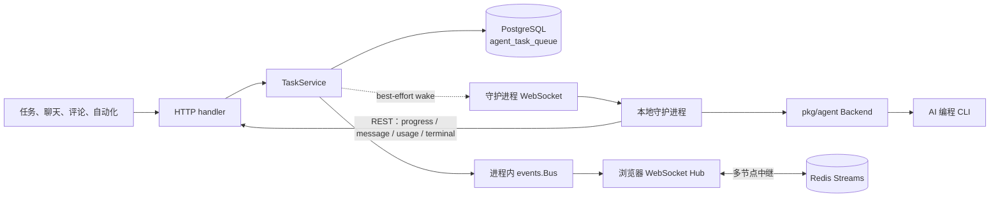
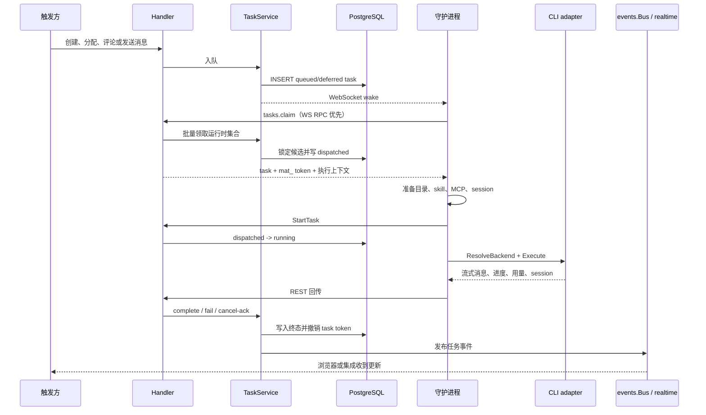

# 智能体执行系统

活跃贡献者：Bohan Jiang、Multica Eve、Jiayuan Zhang

本节说明 Multica 如何把一次智能体触发转换为可领取的 `task`，交给本地守护进程执行，再把进度、消息、用量和终态送回服务端与浏览器。调度记录以 PostgreSQL 为准；WebSocket 和 Redis 负责降低延迟，不承担最终正确性。

## 阅读路线

| 页面 | 先回答的问题 |
| --- | --- |
| [task 生命周期](agent-task-lifecycle.md) | `task` 如何入队、领取、开始、完成、失败、重试、取消和恢复？ |
| [守护进程与运行时](daemon-and-runtime.md) | 哪台机器执行任务？WebSocket 唤醒、批量领取和 HTTP 降级怎样配合？ |
| [智能体适配器与 CLI](agent-adapters-and-cli.md) | 统一执行接口如何覆盖 25 个协议家族和 26 个内建运行时身份？ |
| [实时事件总线](realtime-event-bus.md) | 服务端事件如何跨进程、Redis 和浏览器连接传播？ |

首次接触仓库时，先看[整体架构](../overview/architecture.md)；准备修改代码时，再结合[测试指南](../how-to-contribute/testing.md)。

## 系统边界

一次执行横跨四层：

1. **HTTP 与业务层**：路由进入 handler，`TaskService` 创建或改变 `agent_task_queue` 记录。
2. **调度层**：PostgreSQL 原子领取任务并执行容量、顺序和运行时访问检查。
3. **本地执行层**：守护进程先取得本地并发槽，再通过统一适配器启动 AI 编程 CLI。
4. **投影与实时层**：任务事件驱动通知、活动、外部渠道和浏览器更新；多节点部署通过 Redis 中继。

关键装配位置是 [`server/cmd/server/router.go`](https://github.com/oldwinter/multica/blob/685cf788777e24724b0d82ffe88c56459341fb2a/server/cmd/server/router.go) 和 [`server/cmd/server/main.go`](https://github.com/oldwinter/multica/blob/685cf788777e24724b0d82ffe88c56459341fb2a/server/cmd/server/main.go)。前者注册 REST 与 WebSocket 路由并把依赖注入 handler，后者装配 Redis 中继、后台恢复任务和进程生命周期。

## 三条正确性原则

### PostgreSQL 是调度权威

`agent_task_queue` 保存状态、运行时绑定、优先级、领取时间、prepare lease、session 和终态。领取 SQL 使用 `FOR UPDATE SKIP LOCKED`，让并发请求跳过已经被其他事务锁住的候选行。Redis 中的空领取缓存与重新领取提示只减少无效查询；Redis 缺失或故障时，系统回到数据库检查，不会把缓存判断当作最终事实。

调度和状态转换集中在 [`server/internal/service/task.go`](https://github.com/oldwinter/multica/blob/685cf788777e24724b0d82ffe88c56459341fb2a/server/internal/service/task.go) 与 [`server/pkg/db/queries/agent.sql`](https://github.com/oldwinter/multica/blob/685cf788777e24724b0d82ffe88c56459341fb2a/server/pkg/db/queries/agent.sql)。

### 唤醒只优化延迟

服务端在新任务可领取时向守护进程发送 WebSocket 唤醒。守护进程通常随即发起 `tasks.claim` RPC；如果信号丢失、连接断开或后端不支持该 RPC，周期轮询和 HTTP 领取仍会找到数据库中的任务。反过来，服务端也不能因为唤醒成功就假定任务已经被领取。

守护进程连接与 RPC 见 [`server/internal/daemon/wakeup.go`](https://github.com/oldwinter/multica/blob/685cf788777e24724b0d82ffe88c56459341fb2a/server/internal/daemon/wakeup.go)、[`server/internal/daemon/wsrpc.go`](https://github.com/oldwinter/multica/blob/685cf788777e24724b0d82ffe88c56459341fb2a/server/internal/daemon/wsrpc.go) 和 [`server/internal/daemonws/hub.go`](https://github.com/oldwinter/multica/blob/685cf788777e24724b0d82ffe88c56459341fb2a/server/internal/daemonws/hub.go)。

### 本地机器是执行边界

服务端不直接运行第三方 AI 编程工具。守护进程在运行时主机上准备工作目录、skill、MCP、session store 和进程环境，再由 [`server/pkg/agent/agent.go`](https://github.com/oldwinter/multica/blob/685cf788777e24724b0d82ffe88c56459341fb2a/server/pkg/agent/agent.go) 的统一 `Backend` 接口启动 CLI。代码、宿主 Git 凭据以及第三方 CLI 登录态留在该机器上。

服务端为每次领取签发 `mat_` task token。它绑定用户、工作区、智能体和 `task`，而不是把守护进程自己的长期凭据交给子进程。更多信任边界见[守护进程与运行时](daemon-and-runtime.md#认证与权限边界)。

## 端到端路径

`TaskService` 的终态操作是幂等边界。守护进程可以在网络错误后重发 complete/fail，而不会把已完成任务再次推进。详细异常路径见 [task 生命周期](agent-task-lifecycle.md#失败与自动重试)。

## 主要数据与控制通道

| 通道 | 方向 | 作用 | 正确性兜底 |
| --- | --- | --- | --- |
| REST | 客户端/守护进程 → 服务端 | 创建、start、progress、messages、usage、session、complete、fail、cancel-ack | HTTP 状态、幂等终态和数据库事务 |
| 守护进程 WebSocket | 双向 | wake、heartbeat、`tasks.claim` RPC | 周期轮询与 HTTP claim |
| 进程内 `events.Bus` | 服务内部 | 同步调用投影监听器 | 数据库仍保存任务真相；监听器自行处理副作用 |
| 浏览器 WebSocket | 服务端 → 客户端 | 推送工作区事件 | 客户端重连、重新查询服务端状态 |
| Redis Streams | 服务节点 ↔ 服务节点 | 多副本事件转发与短期重放 | 本地广播、ULID 去重、服务端数据重取 |

浏览器实时连接和守护进程控制连接是两个不同的 Hub。前者传播产品事件，后者只服务运行时身份、心跳、唤醒和 RPC，避免把机器控制面与用户订阅面混在一起。

## 修改入口

| 目标 | 从这里开始 |
| --- | --- |
| 改入队、状态或重试语义 | [`server/internal/service/task.go`](https://github.com/oldwinter/multica/blob/685cf788777e24724b0d82ffe88c56459341fb2a/server/internal/service/task.go) 与 [`server/pkg/db/queries/agent.sql`](https://github.com/oldwinter/multica/blob/685cf788777e24724b0d82ffe88c56459341fb2a/server/pkg/db/queries/agent.sql) |
| 改守护进程 API 或领取响应 | [`server/internal/handler/daemon.go`](https://github.com/oldwinter/multica/blob/685cf788777e24724b0d82ffe88c56459341fb2a/server/internal/handler/daemon.go) |
| 改 WebSocket RPC 或唤醒 | [`server/internal/handler/daemon_rpc.go`](https://github.com/oldwinter/multica/blob/685cf788777e24724b0d82ffe88c56459341fb2a/server/internal/handler/daemon_rpc.go)、[`server/internal/daemonws/notifier.go`](https://github.com/oldwinter/multica/blob/685cf788777e24724b0d82ffe88c56459341fb2a/server/internal/daemonws/notifier.go) |
| 改本地执行流程 | [`server/internal/daemon/daemon.go`](https://github.com/oldwinter/multica/blob/685cf788777e24724b0d82ffe88c56459341fb2a/server/internal/daemon/daemon.go) |
| 增加或修改 CLI 适配器 | [`server/pkg/agent/agent.go`](https://github.com/oldwinter/multica/blob/685cf788777e24724b0d82ffe88c56459341fb2a/server/pkg/agent/agent.go) 与对应 provider 文件 |
| 改事件投影或跨节点广播 | [`server/cmd/server/listeners.go`](https://github.com/oldwinter/multica/blob/685cf788777e24724b0d82ffe88c56459341fb2a/server/cmd/server/listeners.go) 与 `server/internal/realtime/` |

修改任一层时，都要检查相邻层的契约。例如增加任务状态，不只需要改 SQL，还要检查事件名、浏览器投影、守护进程取消观察器和终态幂等测试。

## 关键源码

| 文件 | 作用 |
| --- | --- |
| [`server/cmd/server/router.go`](https://github.com/oldwinter/multica/blob/685cf788777e24724b0d82ffe88c56459341fb2a/server/cmd/server/router.go) | REST、浏览器 WebSocket 和守护进程路由装配 |
| [`server/internal/service/task.go`](https://github.com/oldwinter/multica/blob/685cf788777e24724b0d82ffe88c56459341fb2a/server/internal/service/task.go) | task 入队、领取、状态转换、失败和重试 |
| [`server/pkg/db/queries/agent.sql`](https://github.com/oldwinter/multica/blob/685cf788777e24724b0d82ffe88c56459341fb2a/server/pkg/db/queries/agent.sql) | 队列原子状态转换和容量约束 |
| [`server/internal/daemon/daemon.go`](https://github.com/oldwinter/multica/blob/685cf788777e24724b0d82ffe88c56459341fb2a/server/internal/daemon/daemon.go) | 本地领取、准备、执行、取消和终态上报 |
| [`server/pkg/agent/agent.go`](https://github.com/oldwinter/multica/blob/685cf788777e24724b0d82ffe88c56459341fb2a/server/pkg/agent/agent.go) | CLI adapter 统一接口与协议家族白名单 |
| [`server/internal/events/bus.go`](https://github.com/oldwinter/multica/blob/685cf788777e24724b0d82ffe88c56459341fb2a/server/internal/events/bus.go) | 进程内同步事件总线 |
| [`server/internal/realtime/sharded_stream_relay.go`](https://github.com/oldwinter/multica/blob/685cf788777e24724b0d82ffe88c56459341fb2a/server/internal/realtime/sharded_stream_relay.go) | Redis 分片流中继、重放和保留策略 |
