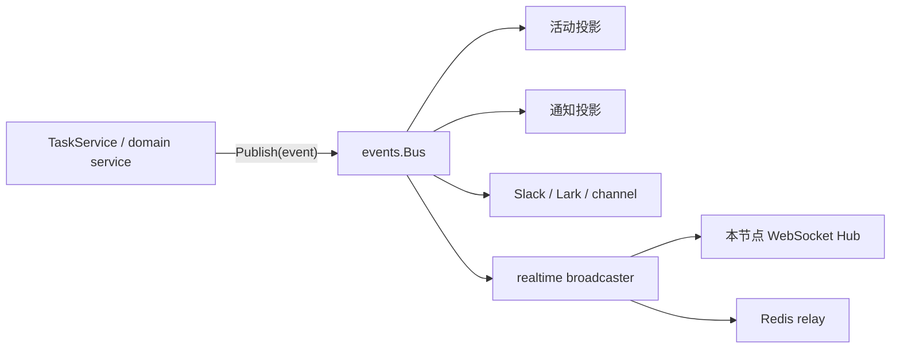
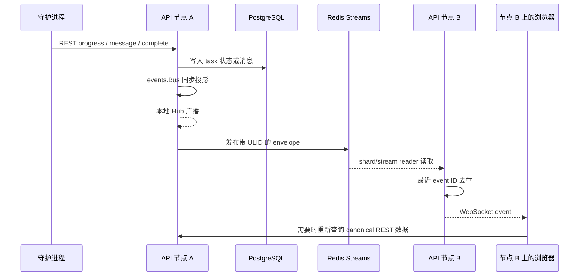

# 实时事件总线

活跃贡献者：Bohan Jiang、Multica Eve、Jiayuan Zhang

Multica 的实时系统分为三层：同步的进程内 `events.Bus`、面向浏览器的 WebSocket Hub，以及可选的 Redis Streams 跨节点中继。任务数据仍以 PostgreSQL 和 REST 查询为准；实时链路负责尽快通知客户端刷新或增量更新。

相关页面：[系统入口](index.md) · [task 生命周期](agent-task-lifecycle.md) · [守护进程与运行时](daemon-and-runtime.md)

## 两套 WebSocket，不同职责

仓库有两套独立连接面：

| 连接 | 服务端实现 | 客户端 | 内容 |
| --- | --- | --- | --- |
| 浏览器 realtime WebSocket | `server/internal/realtime/` | Web / Desktop / Mobile | 工作区事件、任务进度、消息、通知等 |
| daemon WebSocket | `server/internal/daemonws/` | 本地守护进程 | 运行时身份、heartbeat、wake、`tasks.claim` RPC |

守护进程完成任务后通过 REST 写回服务端，服务端再发布产品事件。daemon WS 不直接把 AI CLI 输出广播给浏览器；浏览器 WS 也不能 claim 任务。守护进程控制面见[守护进程与运行时](daemon-and-runtime.md#websocket-控制面)。

## 进程内 `events.Bus`

[`server/internal/events/bus.go`](https://github.com/oldwinter/multica/blob/685cf788777e24724b0d82ffe88c56459341fb2a/server/internal/events/bus.go) 是一个同步发布/订阅总线：

- publisher 所在 goroutine 按监听器注册顺序调用 handler；
- handler panic 会被 recover，避免一个投影让整个发布路径崩溃；
- 它不是持久队列，没有 ack、重试或跨进程消费；
- 慢监听器会延长当前发布调用，因此监听器不应执行无界阻塞工作；
- 监听器拿到的是已经完成业务状态转换后的事件，不拥有数据库状态。

服务端在 [`server/cmd/server/listeners.go`](https://github.com/oldwinter/multica/blob/685cf788777e24724b0d82ffe88c56459341fb2a/server/cmd/server/listeners.go) 注册任务、通知、活动、聊天、外部渠道和实时广播等监听器。装配顺序有语义：同步监听器会按该顺序观察同一事件。

### task 事件

执行系统使用的主要事件包括：

- `task:queued`；
- `task:dispatch`；
- `task:running`；
- `task:waiting_local_directory`；
- `task:progress`；
- `task:message`；
- `task:completed`；
- `task:failed`；
- `task:cancelled`。

事件 payload 只应携带投影所需字段和 scope hint。失败诊断可以在当前进程供内部监听器使用，但跨节点/浏览器投影需要遵守公开 payload 契约，不能把数据库 JSON、prompt、credential 或私有任务状态原样广播。

事件字段和失败投影的回归测试见 [`server/internal/service/task_failure_event_test.go`](https://github.com/oldwinter/multica/blob/685cf788777e24724b0d82ffe88c56459341fb2a/server/internal/service/task_failure_event_test.go)。

## 浏览器 Hub 与订阅范围

[`server/internal/realtime/hub.go`](https://github.com/oldwinter/multica/blob/685cf788777e24724b0d82ffe88c56459341fb2a/server/internal/realtime/hub.go) 管理本节点浏览器连接、认证 scope 和发送队列。连接建立时绑定用户与工作区权限；广播器不能依赖客户端自己声明的任意 workspace ID。

Hub 已有按 scope/resource 订阅的基础设施，但 task/chat 事件当前仍主要按 workspace 广播。客户端收到事件后根据 payload 判断是否 patch 或 invalidate 对应 React Query 缓存。不要假设 "存在 resource subscription API" 就等于所有客户端都已经切换到逐资源订阅。

对任务执行来说，workspace 广播有两个后果：

- 同一工作区的多个页面可以同时更新 issue、聊天、收件箱和运行记录；
- payload 必须保持最小化，因为它会到达工作区内比当前页面更广的连接集合。

## 本地与跨节点广播

### 单节点、无 Redis

未配置 Redis 时，broadcaster 只写本节点 Hub。单个 backend 进程内的客户端会收到实时事件；多副本部署中，连接在另一副本上的客户端不会看到该事件，直到重新查询或刷新。

数据库状态不受影响，因此这是实时性降级，不是任务状态丢失。单节点自托管可以使用该模式；多副本若要求跨节点即时更新，应配置 Redis relay。

### 有 Redis

配置 `REALTIME_RELAY_REDIS_URL` 或共享 `REDIS_URL` 后，事件先在本节点广播，再发布到 Redis。每个服务节点读取 relay，并把其他节点产生的事件送入自己的本地 Hub。

本地先广播再发布 Redis，让当前节点客户端不受 Redis 延迟影响。Redis 发布失败时，本地客户端仍可更新；其他节点稍后通过数据重取恢复。

## relay 模式

实现支持三种 Redis relay：

| 模式 | 行为 | 用途 |
| --- | --- | --- |
| `sharded` | 按 scope 稳定散列到固定数量 stream | 默认生产模式，避免每个 workspace 一个 reader |
| `legacy` | 按旧版 scope stream 组织 | 兼容旧部署与迁移 |
| `dual` | 同时写/读迁移所需路径并去重 | 分阶段从 legacy 切换到 sharded |

默认有 Redis 时使用 sharded。dual 是迁移工具，不应当作永久提高可靠性的第二份队列；同一业务事件可能从两个路径到达，必须依靠 event ID 去重。

daemon runtime 事件不经过浏览器 relay 镜像，防止控制面流量混入产品事件。相关断言在 [`server/internal/realtime/relay_lifecycle_test.go`](https://github.com/oldwinter/multica/blob/685cf788777e24724b0d82ffe88c56459341fb2a/server/internal/realtime/relay_lifecycle_test.go)。

## sharded Streams

[`server/internal/realtime/sharded_stream_relay.go`](https://github.com/oldwinter/multica/blob/685cf788777e24724b0d82ffe88c56459341fb2a/server/internal/realtime/sharded_stream_relay.go) 把事件 scope 稳定映射到 shard。默认配置：

| 参数 | 默认值 | 含义 |
| --- | ---: | --- |
| shard 数 | `8` | 固定数量 Redis Stream |
| 每 shard 近似长度上限 | `2000` | publish 路径上的内存压力阀 |
| 单次读取 | `128` 条 | reader batch |
| blocking read | `5s` | 空闲 reader 阻塞时间 |
| replay grace | `5m` | 节点启动/重连时向前回放窗口 |
| exact trim horizon | `10m` | maintenance 按时间精确裁剪 |
| stream TTL | `15m` | 整条 stream 的可选兜底 TTL |
| TTL enabled | `false` | 默认关闭，需分阶段启用 |

shard key 形如 `ws:relay:shard:<n>`。scope 到 shard 的映射稳定且有界；节点不需要为每个 workspace 启动独立 goroutine。

### 重放与保留

reader 启动时从当前时间减去 replay grace 计算起点。它不是从 stream 的无限历史开始，也不会把 Redis 当作长期审计日志。`MAXLEN` 先提供近似长度限制，maintenance 再用 `XTRIM MINID` 进行精确时间裁剪。

保留值有安全不变量：

- trim horizon 至少覆盖 replay grace 的安全倍数；
- stream TTL 必须晚于 trim horizon；
- 不安全的环境变量组合会被归一到安全下限；
- TTL 关闭时 maintenance 会移除已有 TTL，保留安全回滚能力。

例如 replay grace 改为 `20m` 时，默认推导的 trim horizon 为 `40m`、stream TTL 为 `60m`。若显式给出 `5m` replay、`4m` trim 和 `3m` TTL，则归一为 `10m` trim 与 `15m` TTL。规则由 [`server/cmd/server/main_test.go`](https://github.com/oldwinter/multica/blob/685cf788777e24724b0d82ffe88c56459341fb2a/server/cmd/server/main_test.go) 固定。

### TTL 分阶段启用

`REALTIME_RELAY_STREAM_TTL_ENABLED` 默认 `false`。TTL 删除的是整条 stream，不能在到期前保护 `noeviction` 实例。安全启用流程：

1. 所有 backend 副本先部署支持 TTL maintenance 的版本，保持 TTL 关闭；
2. 设置 `REALTIME_RELAY_STREAM_TTL_ENABLED=true`，再次滚动全部副本；
3. 回滚前先关闭 flag，更新全部副本；
4. 等完整 legacy SCAN 周期，确认 relay key 的 PTTL 为 `-1`，再回滚二进制。

不要在 TTL 仍启用时直接回滚到不理解该策略的版本。配置注释见 [`.env.example`](https://github.com/oldwinter/multica/blob/685cf788777e24724b0d82ffe88c56459341fb2a/.env.example)，维护实现在 [`server/internal/realtime/stream_retention.go`](https://github.com/oldwinter/multica/blob/685cf788777e24724b0d82ffe88c56459341fb2a/server/internal/realtime/stream_retention.go)。

## event ID 与重复投递

每个 envelope 使用 ULID event ID。节点在本地发布时记录该 ID，relay reader 再读到同一事件时跳过；客户端侧也维护最近 128 个 event ID 的窗口，处理双写、重放或连接切换造成的重复。

这提供的是短窗口去重，不是 exactly-once：

- Redis 读取和节点重启可能重新投递；
- 超过最近 ID 窗口的极端迟到事件可能再次到达；
- 事件顺序只在相关 stream/read 路径内有意义，不能替代数据库版本判断；
- 客户端处理应尽量幂等，通常 invalidate canonical query 比依赖事件累计更安全。

事件 ID 同时避免 "本节点先广播，随后从 Redis 收回自己的事件" 造成双更新。

## 节点生命周期

backend 启动时创建本地 Hub、事件监听器和可选 Redis relay。reader 使用独立 blocking Redis client/pool，避免 `XREAD` 阻塞普通 publish 或缓存请求。关闭时先停止新消费者，再取消 reader 与 maintenance，最后关闭连接。

sharded reader 遇到 stream 暂时不存在时会重置读取 generation，并从有界 replay 起点恢复。Redis 暂时不可用不会停止 REST 写入和本地广播；恢复后只能重放仍在保留窗口内的事件，所以客户端仍需依赖重连后的数据查询。

## 与 task REST 回传的关系

实时事件发布在 REST handler 接受并提交数据之后：

1. 守护进程发送 progress/message/usage/complete/fail；
2. handler 校验 daemon、runtime、task 和 workspace；
3. service/SQL 写入数据库；
4. service 发布进程内事件；
5. listeners 更新活动、通知、外部渠道和 realtime；
6. 浏览器收到事件并 patch/invalidate 查询。

因此，浏览器先收到某个 task 事件时，后续 REST 查询应该能够看到对应已提交状态。反向顺序会产生 "事件到了但数据还不存在" 的竞态，修改 handler 时不要把 publish 移到事务提交之前。

对 message 流，高频数据可批量回传。终态处理还会 drain 剩余 transcript，避免进程退出时最后一批消息停在守护进程缓冲区。

## 配置

| 环境变量 | 默认值 | 说明 |
| --- | --- | --- |
| `REDIS_URL` | 空 | 共享 Redis；未设置时 realtime 退回进程内 |
| `REALTIME_RELAY_REDIS_URL` | 回退 `REDIS_URL` | 为 relay 使用独立 Redis/Valkey |
| `REALTIME_RELAY_STREAM_MAXLEN` | `2000` | 每 stream 的近似长度压力阀 |
| `REALTIME_RELAY_REPLAY_GRACE` | `5m` | sharded reader 的回放窗口 |
| `REALTIME_RELAY_TRIM_HORIZON` | `10m` | 精确时间裁剪窗口 |
| `REALTIME_RELAY_STREAM_TTL_ENABLED` | `false` | 是否启用整 stream TTL |
| `REALTIME_RELAY_STREAM_TTL` | `15m` | TTL 时长 |
| `REALTIME_RELAY_TTL_REFRESH_INTERVAL` | `30s` | publish 路径刷新 TTL 的限频间隔 |
| `REALTIME_RELAY_MAINTENANCE_INTERVAL` | `1m` | trim、TTL 修复和 legacy scan 周期 |
| `REDIS_DISABLE_CLIENT_NAME` | `false` | 托管 Redis 禁止 `CLIENT SETNAME` 时设为 `true` |
| `CORS_ALLOWED_ORIGINS` / `ALLOWED_ORIGINS` | localhost/前端 origin | 浏览器 WebSocket `Origin` allowlist |

独立 `REALTIME_RELAY_REDIS_URL` 适合生产环境，避免 relay 的 blocking read 和 stream 内存与请求路径缓存、token cache 或 lease 状态竞争。Redis/Valkey 需要支持 `XTRIM MINID`，即 Redis 6.2 或更高版本。

## 安全边界

浏览器 WebSocket upgrade 需要通过认证、workspace membership 和 `Origin` allowlist。反向代理必须保留 `Upgrade` / `Connection` 头；HTTP 正常不代表 WebSocket 已成功建立。

多节点 envelope 必须携带可验证的 scope，而不是让接收节点向所有连接广播。Relay 是服务端内部通道，不应包含 task token、daemon token、prompt、MCP secret 或本地文件内容。需要详细数据时，客户端用现有认证通过 REST 读取。

daemon WS 使用 daemon auth 和 runtime identity，不受浏览器 `Origin` 订阅模型代替；两条链路分别授权。

## 故障语义

| 故障 | 影响 | 恢复 |
| --- | --- | --- |
| `events.Bus` 某监听器 panic | 该监听器失败，其他流程不应被 panic 终止 | panic recovery、日志与专门副作用补偿 |
| 浏览器连接断开 | 该客户端错过即时事件 | 重连并重新查询 |
| Redis publish 失败 | 其他节点错过事件，本节点仍收到 | canonical REST 数据、后续事件 |
| Redis reader 落后但仍在保留窗内 | 重复或延迟事件 | replay + ULID 去重 |
| reader 落后超过保留窗 | 旧事件不可重放 | 全量 query/invalidation |
| dual mode 重复到达 | 同一事件经两条路径 | 最近 128 个 ID 去重 |
| 无 Redis 的多副本 | 只更新产生事件的节点 | 配置 relay，或接受刷新恢复 |

这套系统是 best-effort 实时广播，不是业务命令总线。需要 "一定执行一次" 的工作不能只挂在浏览器 event 上，应有数据库状态或可恢复后台扫描作为权威。

## 修改与测试

| 修改类型 | 主要入口 | 代表性测试 |
| --- | --- | --- |
| 新增 domain event | [`server/internal/events/bus.go`](https://github.com/oldwinter/multica/blob/685cf788777e24724b0d82ffe88c56459341fb2a/server/internal/events/bus.go)、发布 service、[`server/cmd/server/listeners.go`](https://github.com/oldwinter/multica/blob/685cf788777e24724b0d82ffe88c56459341fb2a/server/cmd/server/listeners.go) | service event 测试、listener 投影测试 |
| 改浏览器连接或 scope | [`server/internal/realtime/hub.go`](https://github.com/oldwinter/multica/blob/685cf788777e24724b0d82ffe88c56459341fb2a/server/internal/realtime/hub.go) | realtime Hub 与 workspace access 测试 |
| 改 legacy relay | [`server/internal/realtime/redis_relay.go`](https://github.com/oldwinter/multica/blob/685cf788777e24724b0d82ffe88c56459341fb2a/server/internal/realtime/redis_relay.go) | [`server/internal/realtime/redis_relay_test.go`](https://github.com/oldwinter/multica/blob/685cf788777e24724b0d82ffe88c56459341fb2a/server/internal/realtime/redis_relay_test.go) |
| 改 sharded relay | [`server/internal/realtime/sharded_stream_relay.go`](https://github.com/oldwinter/multica/blob/685cf788777e24724b0d82ffe88c56459341fb2a/server/internal/realtime/sharded_stream_relay.go) | [`server/internal/realtime/sharded_stream_relay_test.go`](https://github.com/oldwinter/multica/blob/685cf788777e24724b0d82ffe88c56459341fb2a/server/internal/realtime/sharded_stream_relay_test.go) |
| 改保留/TTL | [`server/internal/realtime/stream_retention.go`](https://github.com/oldwinter/multica/blob/685cf788777e24724b0d82ffe88c56459341fb2a/server/internal/realtime/stream_retention.go)、server config | stream retention 测试、`TestShardedRelayConfigFromEnv*` |
| 改 task 浏览器 payload | task service、listener broadcaster | [`server/internal/service/task_failure_event_test.go`](https://github.com/oldwinter/multica/blob/685cf788777e24724b0d82ffe88c56459341fb2a/server/internal/service/task_failure_event_test.go)、issue projection 测试 |

变更 relay 配置时，至少验证：默认值、危险值归一、Redis 断线、进程关闭、重放、重复事件、TTL 修复失败和无 Redis 降级。完整测试命令见[测试指南](../how-to-contribute/testing.md)。

## 关键源码

| 文件 | 作用 |
| --- | --- |
| [`server/internal/events/bus.go`](https://github.com/oldwinter/multica/blob/685cf788777e24724b0d82ffe88c56459341fb2a/server/internal/events/bus.go) | 同步进程内事件发布与 panic recovery |
| [`server/cmd/server/listeners.go`](https://github.com/oldwinter/multica/blob/685cf788777e24724b0d82ffe88c56459341fb2a/server/cmd/server/listeners.go) | domain event 到活动、通知、集成和 realtime 的装配 |
| [`server/internal/realtime/hub.go`](https://github.com/oldwinter/multica/blob/685cf788777e24724b0d82ffe88c56459341fb2a/server/internal/realtime/hub.go) | 本节点浏览器 WebSocket 连接与 scope |
| [`server/internal/realtime/broadcaster.go`](https://github.com/oldwinter/multica/blob/685cf788777e24724b0d82ffe88c56459341fb2a/server/internal/realtime/broadcaster.go) | 本地广播与 Redis publish 组合 |
| [`server/internal/realtime/redis_relay.go`](https://github.com/oldwinter/multica/blob/685cf788777e24724b0d82ffe88c56459341fb2a/server/internal/realtime/redis_relay.go) | legacy Redis Stream relay |
| [`server/internal/realtime/sharded_stream_relay.go`](https://github.com/oldwinter/multica/blob/685cf788777e24724b0d82ffe88c56459341fb2a/server/internal/realtime/sharded_stream_relay.go) | sharded relay、reader 和 maintenance |
| [`server/internal/realtime/stream_retention.go`](https://github.com/oldwinter/multica/blob/685cf788777e24724b0d82ffe88c56459341fb2a/server/internal/realtime/stream_retention.go) | stream TTL 刷新与修复 |
| [`server/cmd/server/main.go`](https://github.com/oldwinter/multica/blob/685cf788777e24724b0d82ffe88c56459341fb2a/server/cmd/server/main.go) | Redis client、relay mode 与生命周期装配 |
